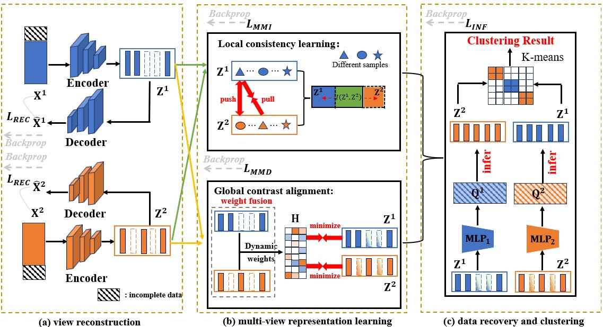

# 2025-NeurIPS-HSACC
Code of "HSACC: Incomplete Multi-view Clustering via Hierarchical Semantic Alignment and Cooperative Completion" (NeurIPS 2025)
## Framework

## Requirements

torch==1.12.0  

tensorflow==2.10.0  

numpy>=1.21.0  

scikit-learn>=0.22.0  

munkres>=1.1.4
## Hyperparameter Settings
In the code, we have provided hyperparameter settings for the Caltech101-20, NoisyMNIST, and LandUse_21 datasets. Below, we additionally include the hyperparameter configurations for the Hdigit and 100leaves datasets.

Hdigit

lambda1 = 0.1
lambda2 = 0.1
lambda3 = 10
lambda4 = 1

100leaves

lambda1 = 0.1
lambda2 = 0.1
lambda3 = 10
lambda4 = 1
## Usage
The code includes example implementations for both two-view and multi-view settings, which can be run via `run.py` (two-view) and `run_multiview.py` (multi-view).

You can adjust the missing rate for the dataset by using the `--missing_rate` argument. For example, `--missing_rate 0.5` sets 50% of the data as missing. This allows you to run experiments under different levels of missing data.
## Citation
If you find HSACC useful in your research, please consider giving us a star and citing it with the following BibTeX entry:

```bibtex
@misc{ding2025incompletemultiviewclusteringhierarchical,
  title={Incomplete Multi-view Clustering via Hierarchical Semantic Alignment and Cooperative Completion}, 
  author={Xiaojian Ding and Lin Zhao and Xian Li and Xiaoying Zhu},
  year={2025},
  eprint={2510.13887},
  archivePrefix={arXiv},
  primaryClass={eess.IV},
  url={https://arxiv.org/abs/2510.13887}
}

